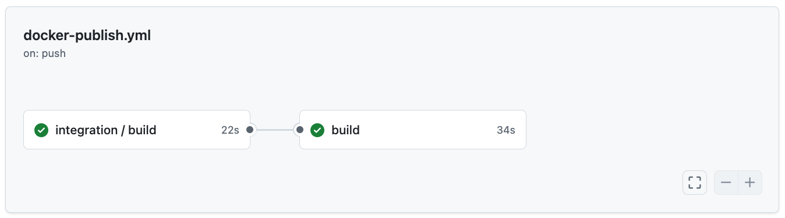

# 02_03 Build and Publish a Container Image

We can make delivery workflows more robust by reusing integration workflows.  Using this approach, we can:

- Avoid duplicating build and test logic across CI and CD workflows
- Ensure delivery pipelines only run after integration succeeds
- Keep changes to build logic centralized in one workflow

## Make an integration workflow reusable

To allow other workflows to run an integration workflow as a job, add the `workflow_call` trigger.

```yaml
on:
  workflow_call:
```

## Call the integration workflow from a delivery workflow

A delivery workflow can include the integration workflow as a job with the `uses` keyword.

```yaml
  integration:
    uses: ./.github/workflows/python-ci-workflow.yml
    permissions:
      contents: read
      checks: write
```

- `uses` references a local workflow file in the same repository
- Permissions are scoped per job, not globally
- This job runs the full integration workflow as-is

---

## Control execution order with dependencies

To ensure delivery steps only run after integration completes successfully, define a dependency using `needs`.

```yaml
  build:
    needs: [integration]
```

- `needs` forces the `build` job to wait for the `integration` job to complete _successfully_.
- If the integration job fails, dependent jobs will not run
- This pattern enforces quality gates between integration and delivery stages

## What this approach enables

- Integration logic runs once and is reused everywhere
- Delivery workflows stay small and focused on publishing
- Software packages and container images are only built and pushed after tests pass

## References

| Reference | Description |
|----------|-------------|
| [docker/setup-buildx-action on GitHub Marketplace](https://github.com/marketplace/actions/docker-setup-buildx) | GitHub Action for setting up Docker Buildx |
| [sigstore/cosign-installer on GitHub Marketplace](https://github.com/marketplace/actions/cosign-installer) | GitHub Action for installing Cosign for container signing |
| [docker/login-action on GitHub Marketplace](https://github.com/marketplace/actions/docker-login) | GitHub Action for authenticating with Docker registries |
| [docker/metadata-action on GitHub Marketplace](https://github.com/marketplace/actions/docker-metadata-action) | GitHub Action for generating Docker image metadata |
| [docker/build-push-action on GitHub Marketplace](https://github.com/marketplace/actions/build-and-push-docker-images) | GitHub Action for building and pushing Docker images |
| [actions/checkout on GitHub Marketplace](https://github.com/marketplace/actions/checkout) | GitHub Action for checking out repository code |

## Lab: Create a Continuous Delivery Workflow for a Container Image

In this lab, you’ll create a continuous delivery workflow that **reuses an existing integration workflow** before building and publishing a container image. The goal is to ensure integration tests always run—and pass—before a container image is pushed to GitHub Packages.

By the end of this lab, your delivery workflow will:

- Call a reusable integration workflow
- Wait for integration to complete using job dependencies
- Build and publish a Python application as a container image

### Instructions

#### 1. Create a new repository and add the exercise files

1. Create a new GitHub repository.
2. Add all of the exercise files for this lesson to the repository.

The project includes:

- A Python web application
- A `Dockerfile` for building a container image
- A reusable integration workflow

> [!IMPORTANT]
> The exercise files also include a `.dockerignore` file which may be hidden if viewed in your systems file browser. If needed, create this file manually.  Having this file in your repo before creating a container image will benefit the image creation process and performance of the resulting image.

#### 2. Move the integration workflow into the correct location

> [!IMPORTANT]
> **This step must be completed** for the lab to complete successfully.

The integration workflow is initially included at the root of the project.

After adding the exercise files to your repo, rename the integration workflow file from:

```yaml
python-ci-workflow.yml
```

to

```yaml
.github/workflows/python-ci-workflow.yml
```

This location is required so other workflows can reference it correctly.

Refer to the following documentation if needed:

- [Moving a file to a new location on GitHub](https://docs.github.com/en/repositories/working-with-files/managing-files/moving-a-file-to-a-new-location)

#### 3. Review the reusable integration workflow

1. Open the integration workflow file:
2. Confirm that it includes the following trigger:

    ```yaml
    on:
      workflow_call:
    ```

    This trigger allows the workflow to be reused by other workflows as a job.

#### 4. Create the delivery workflow using a starter template

1. Go to the **Actions** tab in your repository.
2. Select **New workflow**.
3. Scroll down to the **Continuous integration** section.
4. Locate the **Publish Docker Container** workflow.
5. Select **Configure** to create a new workflow based on this template.

This workflow is already set up to build and push a Docker image to GitHub Packages.

#### 5. Add the integration job to the delivery workflow

Use the following code snippet to update the workflow configuration:

```yaml
  integration:
    uses: ./.github/workflows/python-ci-workflow.yml
    permissions:
      contents: read
      checks: write
```

1. Copy this snippet.
2. Return to the delivery workflow file.
3. Paste the snippet **under the `jobs:` section** and above the existing build job.

This adds the reusable integration workflow as the first job in the pipeline.

#### 6. Add a dependency to the build job

To ensure the container image is only built after the `integration` job succeeds:

1. Locate the `build` job in the delivery workflow.
2. Add the following line under the job definition:

```yaml
    needs: [integration]
```

This creates an explicit dependency so the build job waits for the `integration` job to complete successfully.

#### 7. Update all actions to their latest versions

Using the [reference links for this lesson](#references), update the actions in the delivery workflow to the latest versions.

Update the following actions as needed:

- `actions/checkout`
- `sigstore/cosign-installer`
- `docker/setup-buildx-action`
- `docker/login-action`
- `docker/metadata-action`
- `docker/build-push-action`

This ensures your workflow reflects current best practices and avoids deprecated versions.

#### 8. Commit and run the workflow

1. Commit the updated workflow file to the repository.
2. Go to the **Actions** tab.
3. Select the workflow run triggered by your commit.

You should see:

- An **integration** job running first
- A **build** job waiting for integration to complete

#### 9. Verify the pipeline execution

1. Wait for the integration job to complete.

   - Confirm the test summary appears in the workflow run.
   - This indicates permissions were correctly passed to the reusable workflow.

2. Wait for the build job to complete successfully.



#### 10. Confirm the container image was published

1. Return to the repository’s **Code** tab.
2. Locate the **Packages** section.
3. Select the published container image.

This confirms the continuous delivery workflow ran successfully and published the image to GitHub Packages.

## Shenanigans

### 1. Hidden Files Don't Upload via Drag-and-Drop

The GitHub web interface is designed to focus on project source files and generally filters out hidden files (often called "dotfiles" in Unix/Linux, like `.gitignore` or `.dockerignore` files) and system directories like `.github` during drag-and-drop or standard web uploads.

This is partly a security measure to prevent accidental exposure of sensitive files or system data.

Create these files manually using the web editor or by cloning the repo to your local system, creating the file, and pushing the update back to the repo.

### 2. Reusing workflows from the same repository vs another repository

When you reuse a workflow, you have to tell Github Action how to find it.  In this lesson, you used a workflow from the same repo so just adding a path to it is good enough.

The path has to start with dot slash:

- `./`

Followed by the path to the workflow file:

- `./.github/workflows/python-ci-workflow.yml`

If you wanted to use a workflow from another repo, we’d need to add the repo name, the path to the file, AND a github reference.

- TODO: add reference to a workflow in another repo

<!-- FooterStart -->
---
[← 02_02 Build and Publish a Software Package](../02_02_build_publish_a_package/README.md) | [02_04 Challenge: Develop a Container Image Workflow →](../02_04_challenge_container_workflow/README.md)
<!-- FooterEnd -->
